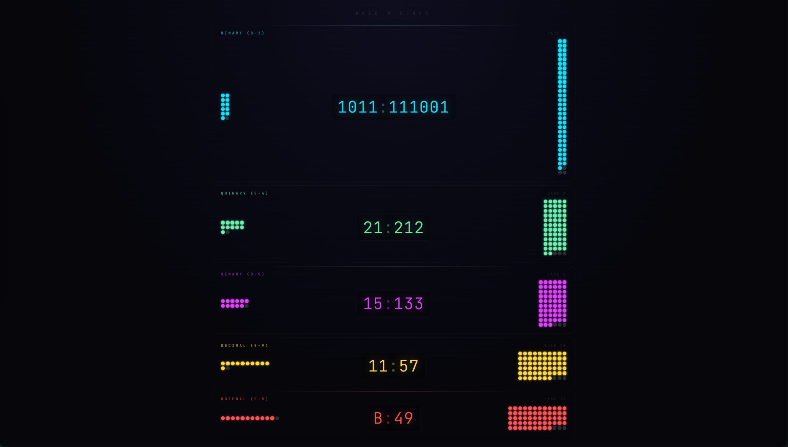
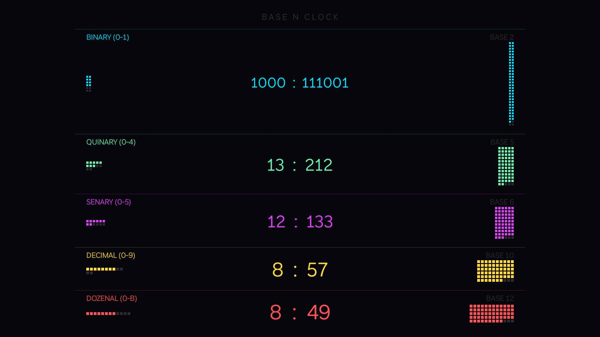

# Base N Clock

See the current time in binary, quinary, senary, decimal, and dozenal. This educational view helps build intuition for base numeral systems through the intuitive and familiar interface of a clock.

Screenshots of the project on web and Roku:

## Web

## Roku

